<picture>
  <source media="(prefers-color-scheme: dark)"  srcset="assets/banner-dunkel.svg">
  <source media="(prefers-color-scheme: light)" srcset="assets/banner-hell.svg">
  
</picture>

Ich baue Werkzeuge, die ohne Internet laufen. Die Daten bleiben auf dem Gerät,
es braucht kein Konto und keinen fremden Dienst.

## Was ich baue

<table>
  <tr>
    <td align="center" width="116">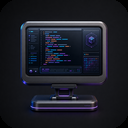 <b>Desktop</b></td>
    <td align="center" width="116">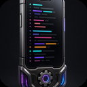 <b>Mobil</b></td>
    <td align="center" width="116">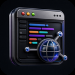 <b>Web</b></td>
    <td align="center" width="116">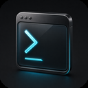 <b>Werkzeuge</b></td>
    <td align="center" width="116">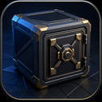 <b>Local-first</b></td>
  </tr>
</table>

- **Desktop** — Electron für macOS, Windows und Linux
- **Mobil** — Flutter
- **Web** — Vanilla JS, ohne Framework, ohne Build-Schritt
- **Werkzeuge** — Python für Auswertung und Automatisierung
- **Local-first** — Anwendungen, die offline vollständig arbeiten

## Plattformen

<table>
  <tr>
    <td align="center" width="116">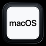 macOS</td>
    <td align="center" width="116">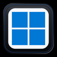 Windows</td>
    <td align="center" width="116"> Linux</td>
    <td align="center" width="116"> Android</td>
  </tr>
</table>

**Sprachen:** JavaScript · Python · Dart · HTML · CSS · Shell

## Womit ich arbeite

**Entwicklung**

<table>
  <tr>
    <td align="center" width="92"> VS Code</td>
    <td align="center" width="92">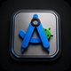 Android Studio</td>
    <td align="center" width="92">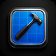 Xcode</td>
    <td align="center" width="92"> GitHub</td>
    <td align="center" width="92">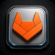 GitLab</td>
    <td align="center" width="92">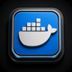 Docker</td>
  </tr>
</table>

**KI**

<table>
  <tr>
    <td align="center" width="92">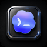 Codex</td>
    <td align="center" width="92"> ChatGPT</td>
    <td align="center" width="92"> Claude</td>
  </tr>
</table>

**Terminal**

<table>
  <tr>
    <td align="center" width="92"> Terminal</td>
    <td align="center" width="92"> iTerm2</td>
    <td align="center" width="92"> Ghostty</td>
    <td align="center" width="92"> Warp</td>
    <td align="center" width="92"> WezTerm</td>
    <td align="center" width="92"> Kitty</td>
  </tr>
</table>

**Browser**

<table>
  <tr>
    <td align="center" width="92"> Safari</td>
    <td align="center" width="92"> Chrome</td>
    <td align="center" width="92"> Firefox</td>
    <td align="center" width="92"> Edge</td>
    <td align="center" width="92"> Brave</td>
    <td align="center" width="92">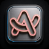 Arc</td>
    <td align="center" width="92"> DuckDuckGo</td>
    <td align="center" width="92">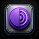 Tor</td>
  </tr>
</table>

**Gestaltung**

<table>
  <tr>
    <td align="center" width="92"> Figma</td>
    <td align="center" width="92"> Blender</td>
    <td align="center" width="92">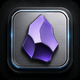 Obsidian</td>
  </tr>
</table>

**Austausch**

<table>
  <tr>
    <td align="center" width="92"> Slack</td>
    <td align="center" width="92"> Teams</td>
    <td align="center" width="92"> Discord</td>
    <td align="center" width="92"> Zoom</td>
    <td align="center" width="92"> WhatsApp</td>
    <td align="center" width="92"> Telegram</td>
  </tr>
</table>

**Ablage und Büro**

<table>
  <tr>
    <td align="center" width="92">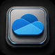 OneDrive</td>
    <td align="center" width="92">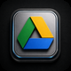 Google Drive</td>
    <td align="center" width="92">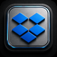 Dropbox</td>
    <td align="center" width="92"> iCloud</td>
    <td align="center" width="92"> Google</td>
    <td align="center" width="92"> Word</td>
    <td align="center" width="92"> Excel</td>
  </tr>
</table>

## Öffentliche Projekte

<table>
  <tr>
    <td width="64" align="center"></td>
    <td><a href="https://github.com/Cehha79/mikatec"><b>mikatec</b></a> 
    Firmen-Website, statisch, ohne Build-Schritt · HTML · CSS · JS</td>
  </tr>
  <tr>
    <td width="64" align="center">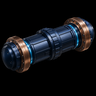</td>
    <td><a href="https://github.com/Cehha79/netz-atlas"><b>netz-atlas</b></a> 
    Die physische Architektur des Internets: Seekabel, Knotenpunkte und Laufzeiten mit Live-Daten · Vanilla JS</td>
  </tr>
  <tr>
    <td width="64" align="center">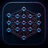</td>
    <td><a href="https://github.com/Cehha79/ki-ai-netz"><b>ki-ai-netz</b></a> 
    Quellengeprüfte Übersicht der großen KI-Anbieter und ihrer Modelle · JavaScript</td>
  </tr>
  <tr>
    <td width="64" align="center"></td>
    <td><a href="https://github.com/Cehha79/aka-recht"><b>aka-recht</b></a> 
    Lokale Aktenmappe für Rechtssachen — offen, kostenlos, für die KI, die man schon hat · Python</td>
  </tr>
</table>

Weitere Arbeit

 

Der größere Teil meiner Projekte liegt in privaten Repositories: Desktop-Werkzeuge
für Dateiverwaltung, Verschlüsselung, Medien und Diagnose, dazu mehrere
Lern- und Nachschlagewerke in reinem HTML.

## Arbeitsweise

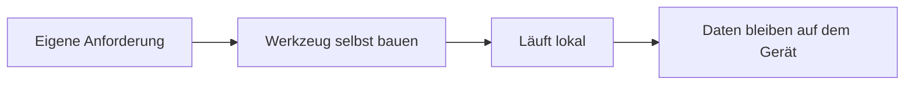

> Unabhängigkeit vor Bequemlichkeit.
> Verstehen vor Übernehmen.
> Sauber gebaut vor schnell fertig.

<b>English</b>

 

**Independent software and IT services · MikaTec · Böblingen, Germany**

I build tools that work without an internet connection. Data stays on the
device — no account, no third-party service required.

### What I build

- **Desktop** — Electron for macOS, Windows and Linux
- **Mobile** — Flutter
- **Web** — vanilla JS, no framework, no build step
- **Tooling** — Python for analysis and automation
- **Local-first** — applications that are fully functional offline

### Public projects

| Project | About | Stack |
| --- | --- | --- |
| [mikatec](https://github.com/Cehha79/mikatec) | Company website, static, no build step | HTML · CSS · JS |
| [netz-atlas](https://github.com/Cehha79/netz-atlas) | The physical architecture of the internet: submarine cables, exchange points and latency, with live data | Vanilla JS |
| [ki-ai-netz](https://github.com/Cehha79/ki-ai-netz) | Sourced overview of the major AI providers and their models | JavaScript |
| [aka-recht](https://github.com/Cehha79/aka-recht) | Local case folder for legal matters — open, free, for the AI you already have | Python |

### Principles

> Independence over convenience.
> Understanding over adopting.
> Built properly over finished quickly.

### Contact

**[mika-tec.com](https://mika-tec.com)** · [info@mika-tec.com](mailto:info@mika-tec.com)

## Kontakt

**[mika-tec.com](https://mika-tec.com)** · [info@mika-tec.com](mailto:info@mika-tec.com)
