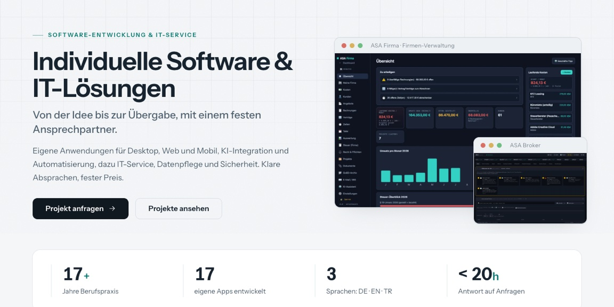

<picture>
  <source media="(prefers-color-scheme: dark)"  srcset="assets/banner-dunkel.svg">
  <source media="(prefers-color-scheme: light)" srcset="assets/banner-hell.svg">
  
</picture>

Ich baue Werkzeuge, die ohne Internet laufen. Die Daten bleiben auf dem Gerät,
es braucht kein Konto und keinen fremden Dienst.

## Projekte

<table>
  <tr>
    <td width="50%" valign="top">
       
      <a href="https://github.com/Cehha79/aka-recht"><b>aka-recht</b></a> 
      Lokale Aktenmappe für eigene Rechtssachen: Dokumente, Beteiligte, Chronologie und Fristenrechnung. Arbeitet über MCP mit der KI, die man schon hat. 
      Python · nur Standardbibliothek
    </td>
    <td width="50%" valign="top">
       
      <a href="https://github.com/Cehha79/netz-atlas"><b>netz-atlas</b></a> 
      Die physische Architektur des Internets: Seekabel, Knotenpunkte und Laufzeiten, mit Live-Daten zu Erdbeben und Ausfällen. 
      Vanilla JS · ohne Build-Schritt
    </td>
  </tr>
  <tr>
    <td width="50%" valign="top">
       
      <a href="https://github.com/Cehha79/ki-ai-netz"><b>ki-ai-netz</b></a> 
      Quellengeprüfte Übersicht der großen KI-Anbieter und ihrer Modelle, deutsch und englisch. 
      Vanilla JS · statisch
    </td>
    <td width="50%" valign="top">
       
      <a href="https://github.com/Cehha79/mikatec"><b>mikatec</b></a> 
      Firmen-Website von MikaTec, statisch und ohne Build-Schritt, mit hellem und dunklem Modus. 
      HTML · CSS · JS
    </td>
  </tr>
</table>

Der größere Teil meiner Arbeit liegt in privaten Repositories: Desktop-Werkzeuge
für Dateiverwaltung, Verschlüsselung, Medien und Diagnose, dazu Lern- und
Nachschlagewerke in reinem HTML.

## Technik

| Bereich | Womit |
| --- | --- |
| Desktop | Electron für macOS, Windows und Linux |
| Mobil | Flutter für Android |
| Web | Vanilla JS, ohne Framework und ohne Build-Schritt |
| Werkzeuge | Python für Auswertung und Automatisierung |
| Grundsatz | Local-first: Anwendungen arbeiten offline vollständig |

## Kontakt

**[mika-tec.com](https://mika-tec.com)** · [info@mika-tec.com](mailto:info@mika-tec.com)

English

 

**Independent software and IT services · MikaTec · Böblingen, Germany**

I build tools that work without an internet connection. Data stays on the
device: no account, no third-party service.

| Project | About | Stack |
| --- | --- | --- |
| [aka-recht](https://github.com/Cehha79/aka-recht) | Local case-file manager for your own legal matters under German law: documents, parties, timeline and deadline calculation. Works over MCP with the AI you already have. | Python, standard library only |
| [netz-atlas](https://github.com/Cehha79/netz-atlas) | The physical architecture of the internet: submarine cables, exchange points and latency, with live data on earthquakes and outages. | Vanilla JS, no build step |
| [ki-ai-netz](https://github.com/Cehha79/ki-ai-netz) | Sourced overview of the major AI providers and their models, in German and English. | Vanilla JS, static |
| [mikatec](https://github.com/Cehha79/mikatec) | Company website of MikaTec, static, no build step, light and dark mode. | HTML · CSS · JS |

Most of my work lives in private repositories: desktop tools for file
management, encryption, media and diagnostics, plus learning and reference
material in plain HTML.

| Area | Stack |
| --- | --- |
| Desktop | Electron for macOS, Windows and Linux |
| Mobile | Flutter for Android |
| Web | Vanilla JS, no framework, no build step |
| Tooling | Python for analysis and automation |
| Principle | Local-first: applications are fully functional offline |

