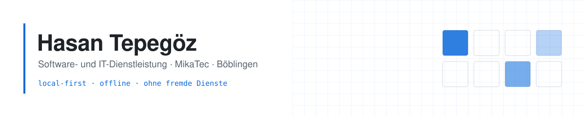
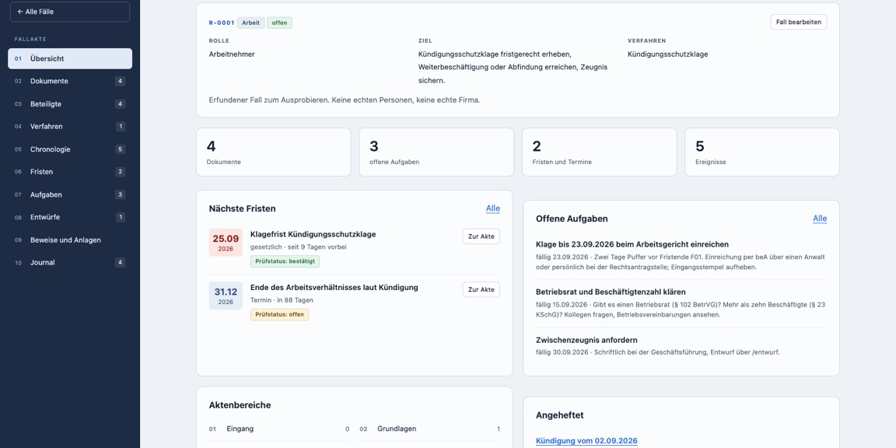
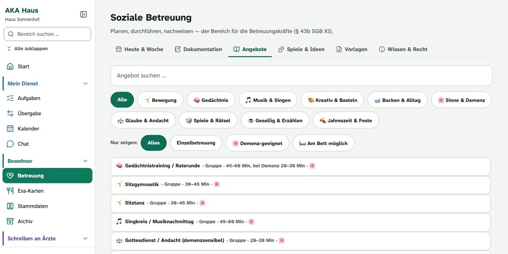
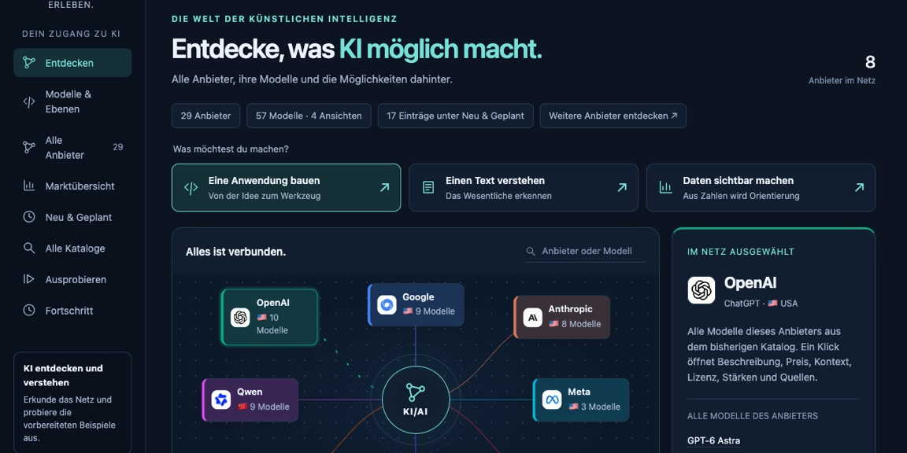
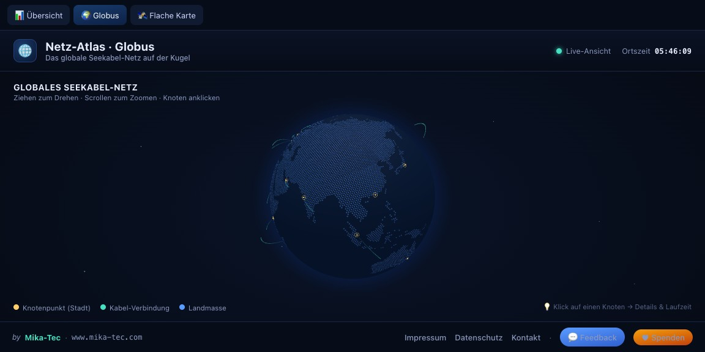

<picture>
  <source media="(prefers-color-scheme: dark)"  srcset="assets/banner-dunkel.svg">
  <source media="(prefers-color-scheme: light)" srcset="assets/banner-hell.svg">
  
</picture>

Ich entwickle individuelle Software: Apps für Desktop, Web und Mobil,
KI-Integration und Software für die Pflege. Dahinter stehen über 20 Jahre
Praxis im Gesundheitswesen.

## Projekte

<table>
  <tr>
    <td width="50%" valign="top">
       
      <a href="https://github.com/Cehha79/aka-recht"><b>aka-recht</b></a> 
      Lokale Aktenmappe für eigene Rechtssachen: Dokumente, Beteiligte, Chronologie und Fristenrechnung. Arbeitet über MCP mit der KI, die man schon hat. 
      Python · nur Standardbibliothek
    </td>
    <td width="50%" valign="top">
       
      <a href="https://github.com/Cehha79/aka-haus-info"><b>aka-haus</b></a> 
      Organisation und Kommunikation im Pflegeheim, eigenständig neben jeder Pflegesoftware. Läuft nur im Hausnetz. In Entwicklung, Vorführung auf Anfrage. 
      Web · iPad · Server im Haus
    </td>
  </tr>
  <tr>
    <td width="50%" valign="top">
       
      <a href="https://github.com/Cehha79/ki-ai-netz"><b>ki-ai-netz</b></a> 
      Quellengeprüfte Übersicht der großen KI-Anbieter und ihrer Modelle, deutsch und englisch. 
      Vanilla JS · statisch
    </td>
    <td width="50%" valign="top">
       
      <a href="https://github.com/Cehha79/netz-atlas"><b>netz-atlas</b></a> 
      Interaktiver Atlas des globalen Internets: Seekabel, Knotenpunkte und Laufzeiten. Mit 3D-Globus, Weltkarte und Live-Daten zu Erdbeben und Internet-Ausfällen. 
      Vanilla JS · Canvas · WebGL
    </td>
  </tr>
</table>

Das sind die öffentlichen Repositories. Der größere Teil meiner Arbeit ist
privat: über 25 Projekte, darunter Desktop-Werkzeuge für Verschlüsselung,
Speicher, Medien, medizinische Bilddaten und Gerätediagnose, eine
Firmen-Verwaltung und ein Markt-Cockpit mit Live-Kursen.
**Alle Projekte mit Bildern: [mika-tec.com/projekte.html](https://mika-tec.com/projekte.html)**

## Hintergrund

Über 20 Jahre im Gesundheitswesen, als Pflegekraft und als Zuständiger für die
Pflegesoftware einer Einrichtung (MediFox Dan, Vivendi, Senso). Daher kenne ich
die Abläufe, für die ich Software baue: eine Gesundheits-App mit Daten nach
FHIR/LOINC, einen Betrachter für medizinische Bilddaten in DICOM und NIfTI und,
noch in Arbeit, [AKA Haus](https://github.com/Cehha79/aka-haus-info), meine eigene App für Organisation und Kommunikation
im Pflegeheim, die neben der Pflegesoftware läuft.

## Technik

| Bereich | Womit |
| --- | --- |
| Sprachen | JavaScript · TypeScript · Python · Dart · Swift · Rust · SQL · HTML · CSS · Shell |
| Desktop | Electron für macOS, Windows und Linux · electron-vite · electron-builder · Universal-Build für Intel und Apple Silicon · native Helfer in Swift und C |
| Mobil | Capacitor für iOS und Android · Flutter · PWA |
| Web | Vanilla JS ohne Framework · Vite · React · Node.js · Canvas · WebGL · Three.js · MapLibre GL · Web Audio |
| KI | MCP-Server (Model Context Protocol) · Schnittstellen zu Claude, GPT und Gemini · Texterkennung mit Tesseract |
| Daten | SQLite · PostgreSQL · IndexedDB · Hive · GeoJSON · FHIR/LOINC |
| Sicherheit | AES-256-GCM · Web Crypto · scrypt · Offline-Betrieb ohne Cloud |
| Medien | ffmpeg · hls.js · pdf.js · DICOM mit Cornerstone3D |
| Grundsatz | Datensparsam: Wo es passt, bleiben die Daten auf dem Gerät |

## Werkzeuge

| Bereich | Womit |
| --- | --- |
| KI-Assistenten | Claude Code · Claude Desktop · Codex · Gemini CLI · GitHub Copilot · Cursor · Antigravity · OpenCode · Cline · aider |
| KI lokal | Ollama · whisper.cpp |
| Editoren | VS Code · Xcode · Android Studio · WebStorm · PyCharm · Neovim |
| Terminal | Ghostty · iTerm2 · kitty · WezTerm · Warp · tmux · zsh mit starship · yazi |
| Versionen | Git · GitHub CLI · GitHub Desktop · GitKraken · lazygit · GitHub Pages |
| Laufzeiten | Node.js · Bun · Python · Rust · Go · Java · Dart und Flutter · Swift |
| Container und VMs | Docker mit OrbStack · Podman · UTM · VirtualBox · QEMU |
| Daten und APIs | DBeaver · Postman · HTTPie · SQLite |
| Code-Qualität | Ruff · Prettier · ESLint · HTMLHint · ShellCheck · esbuild |
| Gestaltung und 3D | Figma · Blender · Godot · draw.io · KiCad · Autodesk Fusion |

## Kontakt

**[mika-tec.com](https://mika-tec.com)** · [info@mika-tec.com](mailto:info@mika-tec.com)

English

 

**Independent software and IT services · MikaTec · Böblingen, Germany**

I develop custom software: apps for desktop, web and mobile, AI integration
and software for nursing care, backed by more than 20 years of hands-on
experience in healthcare.

| Project | About | Stack |
| --- | --- | --- |
| [aka-recht](https://github.com/Cehha79/aka-recht) | Local case-file manager for your own legal matters under German law: documents, parties, timeline and deadline calculation. Works over MCP with the AI you already have. | Python, standard library only |
| [aka-haus](https://github.com/Cehha79/aka-haus-info) | Organisation and communication for nursing homes, running alongside any nursing software, inside the home's own network only. In development, demo on request. | Web, iPad, on-site server |
| [ki-ai-netz](https://github.com/Cehha79/ki-ai-netz) | Sourced overview of the major AI providers and their models, in German and English. | Vanilla JS, static |
| [netz-atlas](https://github.com/Cehha79/netz-atlas) | Interactive atlas of the global internet: submarine cables, network hubs and latency. With a 3D globe, world map and live data on earthquakes and internet outages. | Vanilla JS · Canvas · WebGL |

These are the public repositories. Most of my work is private: more than 25
projects, including desktop tools for encryption, storage, media, medical
imaging and device diagnostics, a business administration app and a market
cockpit with live prices.
**All projects with screenshots: [mika-tec.com/projekte.html](https://mika-tec.com/projekte.html)**

**Background.** More than 20 years in healthcare, working in nursing care and
as the person responsible for the nursing software of a care facility (MediFox
Dan, Vivendi, Senso). That is why I know the workflows I build software for: a health app
with data in FHIR/LOINC, a viewer for medical imaging in DICOM and NIfTI and,
still in progress, [AKA Haus](https://github.com/Cehha79/aka-haus-info), my own app for organisation and communication in
the care home, running alongside the nursing software.

| Area | Stack |
| --- | --- |
| Languages | JavaScript · TypeScript · Python · Dart · Swift · Rust · SQL · HTML · CSS · Shell |
| Desktop | Electron for macOS, Windows and Linux · electron-vite · electron-builder · universal builds for Intel and Apple Silicon · native helpers in Swift and C |
| Mobile | Capacitor for iOS and Android · Flutter · PWA |
| Web | Vanilla JS without a framework · Vite · React · Node.js · Canvas · WebGL · Three.js · MapLibre GL · Web Audio |
| AI | MCP servers (Model Context Protocol) · APIs of Claude, GPT and Gemini · OCR with Tesseract |
| Data | SQLite · PostgreSQL · IndexedDB · Hive · GeoJSON · FHIR/LOINC |
| Security | AES-256-GCM · Web Crypto · scrypt · offline operation without cloud |
| Media | ffmpeg · hls.js · pdf.js · DICOM with Cornerstone3D |
| Principle | Data-sparing: where it fits, data stays on the device |

| Tools | With |
| --- | --- |
| AI assistants | Claude Code · Claude Desktop · Codex · Gemini CLI · GitHub Copilot · Cursor · Antigravity · OpenCode · Cline · aider |
| Local AI | Ollama · whisper.cpp |
| Editors | VS Code · Xcode · Android Studio · WebStorm · PyCharm · Neovim |
| Terminal | Ghostty · iTerm2 · kitty · WezTerm · Warp · tmux · zsh with starship · yazi |
| Version control | Git · GitHub CLI · GitHub Desktop · GitKraken · lazygit · GitHub Pages |
| Runtimes | Node.js · Bun · Python · Rust · Go · Java · Dart and Flutter · Swift |
| Containers and VMs | Docker with OrbStack · Podman · UTM · VirtualBox · QEMU |
| Data and APIs | DBeaver · Postman · HTTPie · SQLite |
| Code quality | Ruff · Prettier · ESLint · HTMLHint · ShellCheck · esbuild |
| Design and 3D | Figma · Blender · Godot · draw.io · KiCad · Autodesk Fusion |

